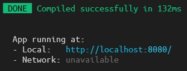

# 사전과제 1번
## 실행방법
* hw1 폴더의 main.html을 실행하시면 됩니다.   
       

# 사전과제 2번
## 실행방법
* npm이 필요합니다.
* hw2 폴더에서 쉘을 실행하세요.
* 아래의 커맨드를 순서대로 실행하시면 됩니다.
```
> npm install
> npm run serve
```
* 아래 사진와 같은 문구가 뜨면 개발용 서버 실행에 성공한 것입니다.   

* 해당 주소의 로컬 서버로 접속하시면 내용물을 확인하실 수 있습니다.